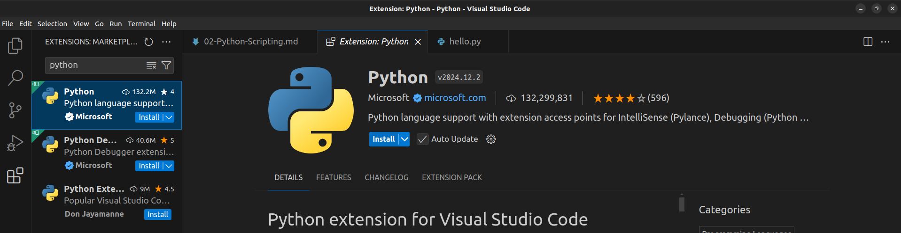
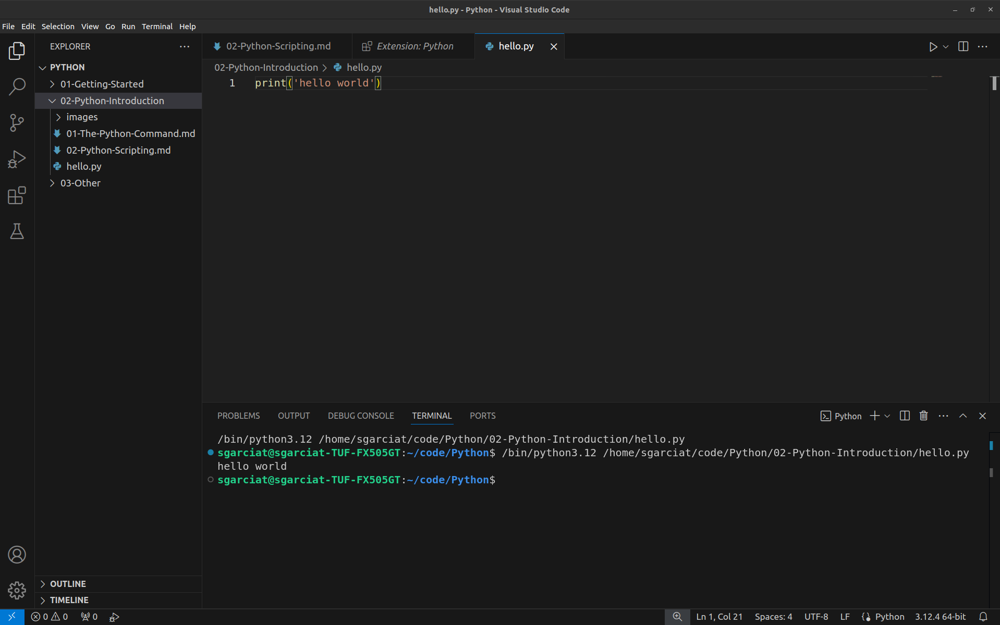

# 9. Code (Text) Editors

To write a Python script, we need a text editor, and preferrably, a code editor.
Here are examples of applications that are *not* text editors:

- **Microsoft Word**: This is a word processor, an example of a **WYSIWYG**
- (What You See Is What You Get editor) editor, and it is not suitable for coding.
- **Google Docs**: Also inappropriate for coding.

Here are examples of text editors that are appropriate for coding and available from the command line:

- `vim`: An editor created by Bill Joy. You can use it by running the command `vim`. To exit, type a colon `:`, type `q`, and press Enter.  It is very popular and available on most UNIX-based system. It is not very beginner friendly, but since it has been around for so long, there are many tutorials. For example, [see this interactive `vim` tutorial](https://www.openvim.com/).
- `emacs`: Also an old and popular editor, and has a learning curve, too.
- `nano`: An easy to use editor, better suited for beginners.

We will stray away from these even in our case. An alternative is to use a GUI
(graphical user interface):

- **Visual Studio Code**
- **Sublime Text**
- **Atom**

There are also programs called **IDEs**, or **Integrated Development Environments**, which
often serves as an all-in-one solution. Specific to Python we have:

- **PyCharm** by JetBrains.
- **IDLE**, which ships with your Python installation.
- **Spyder**, which is part of the Anaconda distribution of Python.
- **Jupyter Notebook**, which is popular in the scientific community for experiments,
plotting, and making reports.

We will use **Visual Studio** and **Jupyter**.

## Installing Visual Studio Code

[**VS Code**](https://code.visualstudio.com/), short for *Visual Studio Code*, and not to be confused with [*Visual Studio*](https://visualstudio.microsoft.com/), is an open source code editor developed by Microsoft and available on Windows, macOS, and Linux.

Navigate to the [official VS code installation instructions for macOS](https://code.visualstudio.com/docs/setup/mac). Be sure to follow the instructions that enable you to [launch VS Code from the command line](https://code.visualstudio.com/docs/setup/mac#_launching-from-the-command-line) using the `code` command.

A convenience of VS Code is that you can use it to view rendered Markdown files (`.md` extension),
such as these provided in this tutorial.

## Creating Python File, Opening it, and Running it from VS Code

Open your terminal, and create a Python file by using the `touch` command, and then
open it by using the `code` command, available now that you have installed Visual Studio Code:

```bash
touch hello.py
code hello.py
```

Th Visual Studio application should spring up, and a file explorer area on the left should
show your `hello.py` file. Click the file so that an editor tab for it appears in the center
area, and type the following text in it:

```python
print('hello world!')
```

From your terminal, you can type the following to run the command:

```bash
python hello.py
```

The Python interpreter will read the text in your file and run the commands in it. You
should see the following in your terminal:

```text
hello world
```

Alternatively, you can install an extension with Visual Studio Code to run the command
from within VS Code.

Click on the `Extensions` icon on the left (looks like squared lego building blocks),
search for the Python extension by Microsoft, and install it:



Then, click the `Run` button, which is a triangle-shaped button on the top-right
of your editor:



Notice that your code runs in a window at the bottom. This is an **integrated terminal**,
similar to your terminal application, but within VS Code. It's a convenience provided by
Visual Studio Code so that you don't have to keep your `Terminal` application open while
using Visual Studio Code. You can safely enter your shell commands here if you wish.

## References

- [VS Code Website Install](https://code.visualstudio.com/docs/setup/mac).
- [Launching VS Code from Command Line](https://code.visualstudio.com/docs/setup/mac#_launching-from-the-command-line) using the `code` command.
- [Video Tutorial On Installing VS Code for macOS](https://www.youtube.com/watch?v=w0xBQHKjoGo)
